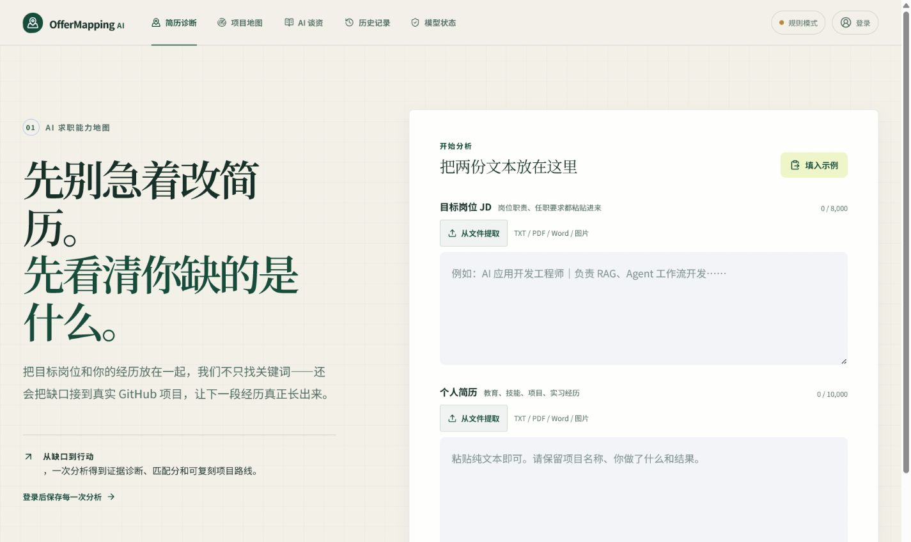
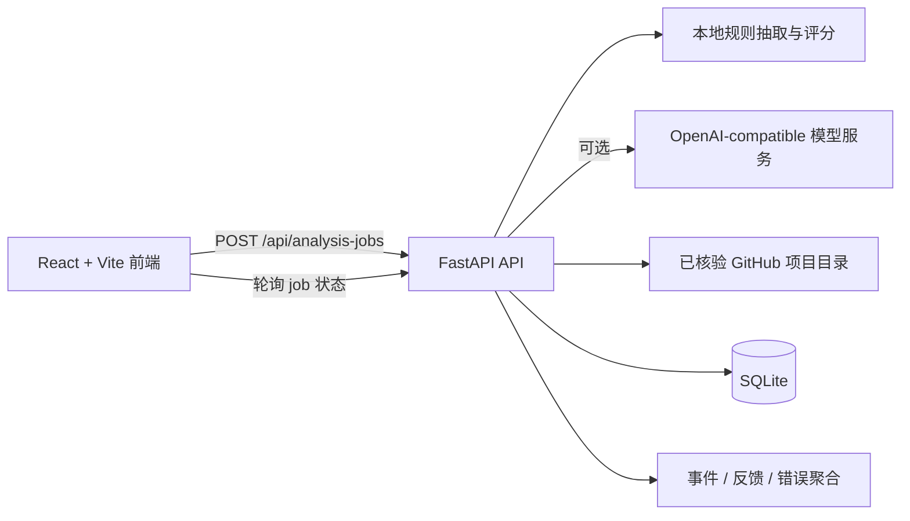

# OfferMapping AI

面向 AI 岗位新人的求职能力地图：把目标岗位 JD 与个人简历之间的差距，转成可解释的匹配分、证据清单和真实 GitHub 项目路线。

> 当前定位：可公开演示的 MVP。规则模式无需任何模型密钥即可运行；接入第三方模型前，请先阅读下方的数据流向与限制说明。



## Demo 流程

1. 打开首页，点击“填入示例”，确认 JD 与简历文本。
2. 点击“开始绘制能力地图”。前端创建分析任务并轮询服务端状态，完成后展示报告。
3. 在报告中查看匹配度、证据账本、优先缺口和主项目路线。
4. 点击“复制表述”获得一条可继续修改的简历草稿，并用“有帮助 / 需要改进”提交最小反馈。
5. 登录后可回看历史记录，也可以在账户页删除账户及其关联数据。

无密钥演示链路使用 `backend.app.local_extract` 与本地规则生成器，不调用外部模型，适合公开 Demo、CI 和面试现场演示。

## 架构



分析分数由规则计算；模型只负责可选的结构化抽取和解释生成。每个分析都会保留 request ID，便于排查失败。

## 当前版本

- 简历诊断：JD + 简历结构化解析、硬门槛、证据强度、Gap 和规则评分
- 项目推荐：只从已核验的 GitHub 项目目录中选择，不允许模型编造仓库
- 项目雷达：22 个已核验仓库，按“最好用 / 最好玩”分榜，并按入门 → 进阶 → 挑战排序
- AI 谈资：深度谈资卡 + 今日 AI 速览
- 本地账号：注册登录、分析保存和历史报告回看
- 兼容模型路由：抽取、生成、Judge A、Judge B 分角色配置
- 无模型密钥时自动使用本地可复现规则，方便先验收完整流程
- 任务轮询：`POST /api/analysis-jobs` 创建任务，`GET /api/analysis-jobs/{job_id}` 获取状态
- 安全护栏：登录、分析、文档解析、事件和反馈限流；分析输入字符预算与模型输出 token 上限
- 最小可观测性：`X-Request-ID`、错误聚合表、事件表、反馈表

## 本地运行

后端：

```powershell
python -m uvicorn backend.app:app --host 127.0.0.1 --port 8001
```

前端：

```powershell
npm.cmd run dev
```

打开：`http://127.0.0.1:4173/`

如果只想启动无密钥规则 Demo，可直接运行后端和前端，不填写任何模型配置：

```powershell
python -m uvicorn backend.app:app --host 127.0.0.1 --port 8001
npm.cmd run dev
```

## 配置兼容模型

复制 `.env.example` 为 `.env`，至少填写抽取和生成两组配置：

```env
EXTRACTOR_BASE_URL=https://api.example.com/v1
EXTRACTOR_API_KEY=...
EXTRACTOR_MODEL=...

GENERATOR_BASE_URL=https://api.example.com/v1
GENERATOR_API_KEY=...
GENERATOR_MODEL=...
```

接口默认使用 OpenAI-compatible `/chat/completions`。若供应商不支持 `response_format`，后端会自动降级为普通 JSON 提示词模式。

需要做多模型横评时，可复制 `backend/models.example.json` 为 `backend/models.json`，为每个候选模型建立 profile，再用 `EXTRACTOR_PROFILE`、`GENERATOR_PROFILE`、`JUDGE_A_PROFILE` 和 `JUDGE_B_PROFILE` 切换。密钥名称保存在 profile 中，密钥本身仍只放环境变量。

## 数据与安全

- 本地 SQLite：`backend/offermapping.db`
- 密码使用 PBKDF2-SHA256 哈希
- API Key 仅由后端读取，不进入前端产物
- 匹配分由代码规则计算，模型只负责抽取和生成解释
- 模型调用记录模型名、耗时、Token、Schema 状态和错误，不记录简历原文到模型运行表
- 未登录分析默认不进入用户历史；登录后会保存分析记录（包含输入文本），可在账户页删除账户和关联数据
- 配置第三方模型后，JD 与简历可能发送到所选服务商；其数据保留、训练和跨境处理政策以服务商条款为准
- 生产环境必须替换 `TOKEN_SECRET`，并把 `ALLOWED_ORIGINS` 限制为实际域名

### 公开 Demo 的限制

- 当前限流是单实例内存实现，多副本部署需要 Redis、API Gateway 或平台级限流。
- SQLite 适合 Demo 和小规模探索，不适合作为高并发生产数据库。
- 规则模式不是招聘结果预测，也不保证 offer；它只说明输入文本中能被追溯的技能证据。
- 项目推荐来自静态目录，仓库状态和外部链接需要定期复核。
- 真实案例验证尚未完成；在授权、脱敏的真实样本完成前，不宣称准确率或线上效果。

## 指标解释

| 指标 | 含义 | 计算方式 |
| --- | --- | --- |
| 匹配度 | 当前输入对岗位要求的可行动覆盖度 | 硬技能 60% + 加分项 20% + 项目证据覆盖 20% |
| project-backed | 简历句子包含可追溯的项目交付动作 | 局部引用命中项目 / 开发 / 部署等交付语义 |
| listed-only | 只在技能栏、课程或知识描述中出现 | 不代表完成过真实交付 |
| missing | JD 命中但简历没有可接受证据 | 进入优先缺口列表 |
| Evidence accuracy | 证据等级与人工标注一致的比例 | 只在有 gold 标注的评测集上计算 |
| Evidence overclaim rate | 把 listed-only / missing 高估为 project-backed 的比例 | 越低越好，目标 ≤ 5% |

规则基线与模型评测使用合成、脱敏数据集；任何真实案例都会单独标注样本来源、授权状态与验证范围。

## 质量检查

```powershell
npm.cmd run lint
npm.cmd run build
python -m py_compile backend\app.py backend\catalog.py
python -m unittest discover -s backend/tests -t .
python -m unittest discover -s evals/tests -t .
npm.cmd run test:e2e
```

## 发布状态

本地发布基线包含 Git 提交历史与 `v0.2.0-demo` tag。远程仓库和公开部署需要有效的 GitHub 登录态、仓库地址以及部署平台凭据；当前工作区不会伪造远程地址或提交密钥。

真实案例的授权、脱敏、盲评和结果声明模板见 [`documentation/real-case-validation.md`](documentation/real-case-validation.md)；本版本尚未声称已完成真实案例验证。版本变更记录见 [`docs/releases/v0.2.0-demo.md`](docs/releases/v0.2.0-demo.md)。
